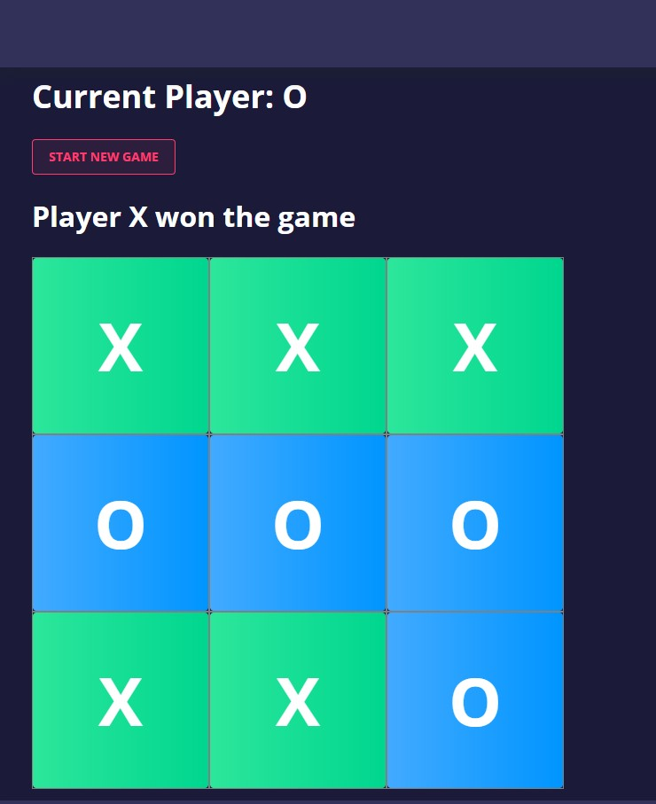

# TicTacToe

- Angular 10.0.8
- [Nebular theme](https://akveo.github.io/nebular/) 

## Running

Run `ng serve` for a dev server. Navigate to `http://localhost:4200/`. The app will automatically reload if you change any of the source files.

## Screen result

